# Report

## Project Description

The project that was assigned to us was the jTimeSched, it's a simple program used to keep track of the time spent on projects and tasks.

The source code is organized primarily in three folders: "gui" that contains all the graphic user interface elements, "misc" that only has a text formater class and "project" which contains the project classes for use in the program. There is also the main java class located in the root folder of the project.

## Static Testing

Static testing is an essential part of software development as it checks the code before compile time, saving time. It is also important as it checks for readability and code conventions.

## PMD

We use PMD to detect errors. A lot of errors are detected

### 1st error

#### Rule violated
One of the warnings of priority 3 on 120 and 122, is the concerning the rule : __IfElseStmtsMustUseBraces__.


#### Type
False Positive

#### Solution

The best solution here is to remove the rule concerning the braces arounf if/else statements. We can see that none of this statements has braces and the priority is not hidh, so we can easily remove all the errors due to this useless rule.
For that, we have to remove the line concerning this rule in the file [pmd-braces.xml](../jtimesched/rulesets/pmd-braces.xml) (whre it is contained).

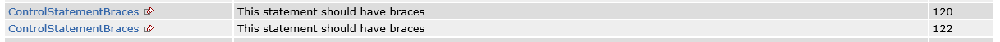

### 2nd error

#### Rule violated
The error of priority 1 is violating the rule __ClassWithOnlyPrivateConstructorsShouldBeFinal__ which is contained in the rule file [pmd-design.xml](../jtimesched/rulesets/pmd-design.xml)

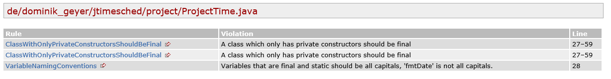

#### Type
Correct Positive

#### Solution

Here the rule is very important and could cause a lot of damages as it is priority 1. So the solution is to change the source code to match this rule.

- before 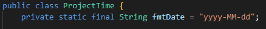
- after 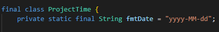


### 3rd error

#### Rule violated
The rule __ShortVariable__ is violated, it is stored in the file [pmd-naming.xml](../jtimesched/rulesets/pmd-naming.xml) (at line 81).
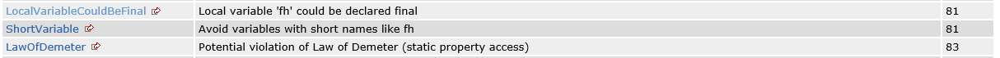

#### Type
False Positive

#### Solution

As before, with the if/elses braces, the number of occurrences of this error is really high (~100) and th impact is not dangerous right nowm. It's a warning. So, the most efficient way to deal with this error is to change the rule to only accept variable of 2 or more letters. It should decrease the number of occurrences but still noticed the one letter variables which are not the best way to implement.


### 4th error

#### Rule violated
The rule __CommentRequired__ is violated at lines 37-46.

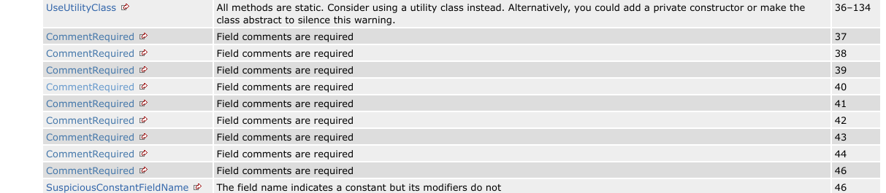

#### Type
False Positive

#### Solution

This comment could mean something, but in this case, none of the code follows the structure implied by the rules, so we should ignore it.

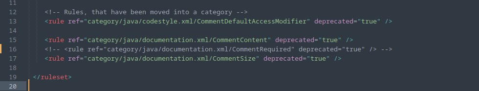


### 5th error

#### Rule violated

The rule __UselessQualifiedThis__ is violated at lines 152 and 154.

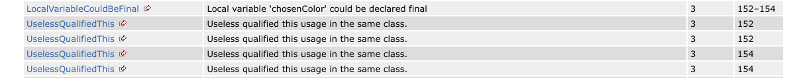

#### Type

Correct Positive

#### Solution

The static invocation of the class is completely unnecessary if you are already using the keyword "this" in this context.

- Before

```java
Color chosenColor = JColorChooser.showDialog(ColorDialog.this,
      "Choose a custom color",
      ColorDialog.this.currentColor);
```

- After

```java
Color chosenColor = JColorChooser.showDialog(this,
      "Choose a custom color",
      this.currentColor);
```


## Checkstyle

### 1st error

#### Broken Rule

The rule __DesignForExtension__ is broken 77 times all across the document.

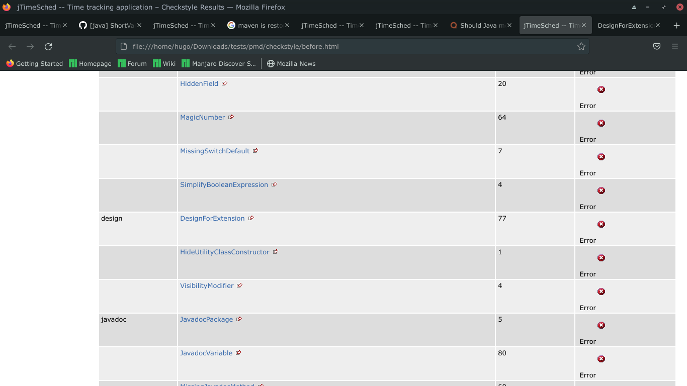

#### Type

False Positive

#### Solution

DesignForExtension is only important if we are creating libraries to be used by other programs (designed to be extended with subclasses). As this is an application, it's not really important.

- Before

```xml
    <!-- Checks for class design                         -->
    <!-- See https://checkstyle.org/config_design.html -->
    <module name="DesignForExtension"/>
```

- After

```xml
    <!-- Checks for class design                         -->
    <!-- See https://checkstyle.org/config_design.html -->
    <!-- <module name="DesignForExtension"/> -->
```

### 2nd error

#### Broken Rule

The rule __LineLength__ is broken 241 times all across the document.

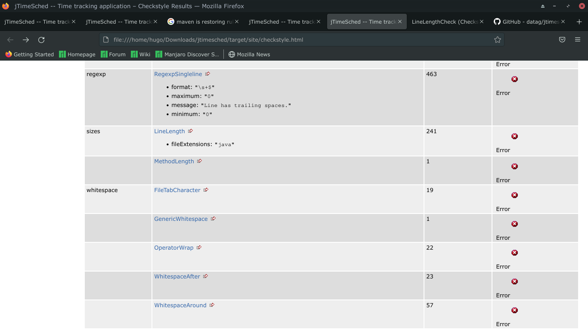

#### Type

False Positive

#### Solution

LineLength is important in some contexts, the if the code is read in a tiny monitor or ancient editor, having more than 80 chars might make the code really hard to edit. In this case, it was clearly not relevant to the author and so there don't need to be so many errors. Even so, a limit to the number of characters per line is always good practice.

- Before

```xml
<module name="LineLength">
    <property name="fileExtensions" value="java"/>
</module>
```

- After

```xml
<module name="LineLength">
    <property name="fileExtensions" value="java"/>
    <property name="max" value="120"/>
</module>
```

COULDNT TEST THIS ONE

### 3rd error

#### Broken Rule

The rule __RegexpSingleline__ is broken 463 times all across the document.

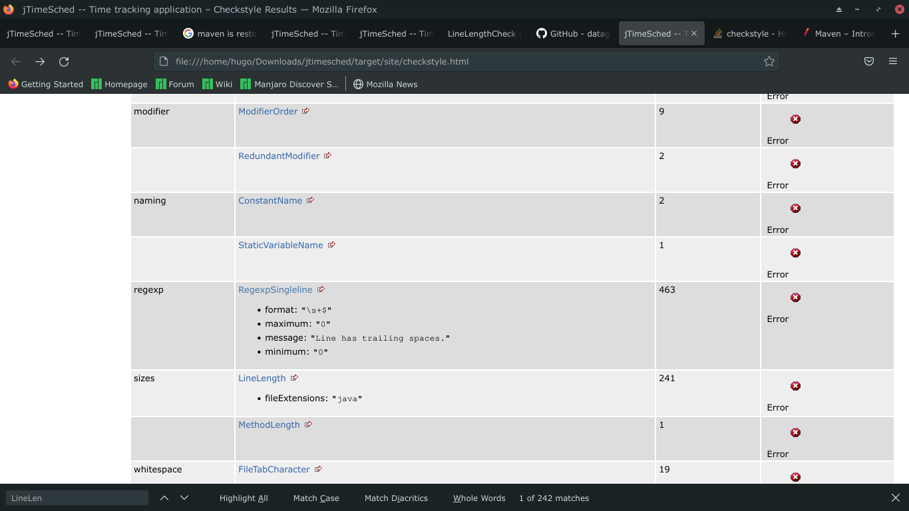

#### Type

False Positive

#### Solution

In this case it is just detecting trailing white space, which is basically harmless and some editors leave it behind, it can be left on for multiple spaces.

- Before

```xml
  <module name="RegexpSingleline">
    <property name="format" value="\s+$"/>
    <property name="minimum" value="0"/>
    <property name="maximum" value="0"/>
    <property name="message" value="Line has trailing spaces."/>
  </module>
```

- After

```xml
 <!-- <module name="RegexpSingleline">
    <property name="format" value="\s+$"/>
    <property name="minimum" value="5"/>
    <property name="maximum" value="5"/>
    <property name="message" value="Line has trailing spaces."/>
  </module> -->
```

COULDNT TEST THIS ONE

### 4th error

#### Broken Rule

The rule __MagicNumber__ is broken 64 times all across the document.

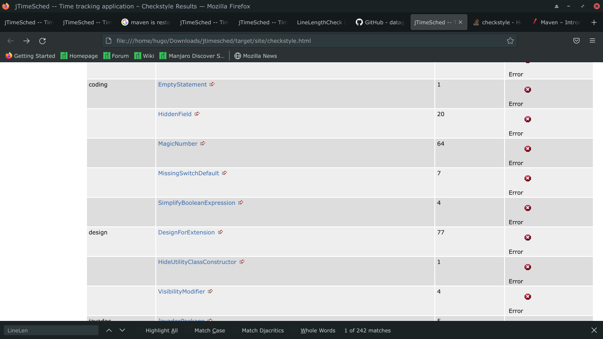

#### Type

True Positive

#### Solution

Magic Numbers are a bad practice, we fixed an example in the code, but there are multiple that should be fixed.

- Before

```java
Dimension sizeTf = new Dimension(100, this.tfHighlight.getMinimumSize().height);
```

- After

```java
private static final int DEFAULT_WIDTH = 100;

Dimension sizeTf = new Dimension(DEFAULT_WIDTH, this.tfHighlight.getMinimumSize().height);
```

COULDNT TEST THIS ONE

### 5th error

#### Broken Rule

The rule __FileTabCharacter__ is broken 19 times all across the document.


#### Type

True Positive

#### Solution

Tabs are used almost nowhere in the source code, random tab indentations should be avoided to keep code readability and consistency across editors, readers, git etc. The solution is to search and replace all the tabs across the project.

