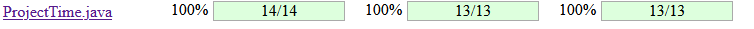
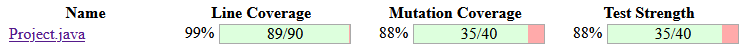
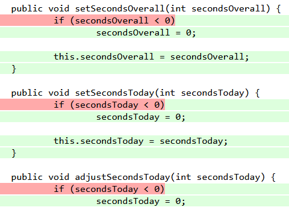
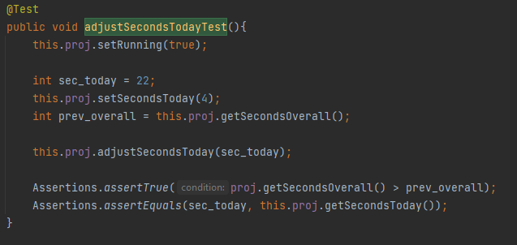
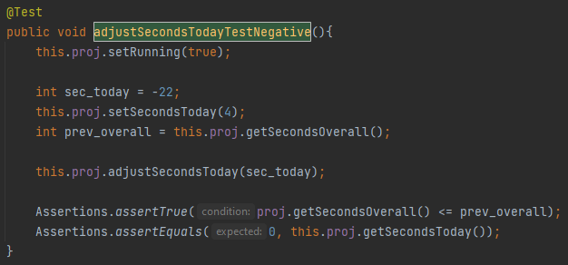

- Mutation score of the unit tests you developed in all assignments.
- Equivalent mutants, if any.
- Brief description of test cases developed to increase project’s mutation score.

# Mutation Testing
__We didn't implemented the mutation tests method on the class _ProjectTableModel.java_ because some of the functionnalities were not supported by Pitest.__

# Mutation Score

We developped more unit tests for each functions. Our Line coverage score increased but most importantly, our mutation score increased a lot.

We have reached 100% mutation score for the class _ProjectTime.java_ by doing very simple tests.

And we reached a good level of mutation score in the class _Project.java_. The line coverage is almost 100% and the mutation score is high but we coud'nt KILL some mutations.

The functions were we could'nt KILL the mutation are _setSecondsOverall()_, _setSecondsToday()_, _adjustSecondsToday()_. The main problem was their `if` condition. Our tests KILLED the `negated conditional` but SURVIVED the `boundary change`. We didn't find a way to reinforced our tests in order to kill that mutation.

# Equivalent Mutants

So after having this problem with the `if` conditions we came to the conclusion that these mutations were __equivalent mutants__. 
Even with the lowest diference between the value sented (/ compared to the boundary) and the boundary we can't assure that the mutatuon will be KILLED.

# Test Cases

## Project.adjustSecondsToday(...)

- adjustSecondsTodayTest()
- adjustSecondsTodayTestNegative()

The assertions on the adjustSecondsToday() function test, were a little bit tricky but interesting to do. So here we have to assert two variables : `this.secondsOverall` and `this.secondsToday`.
Their output is different if the `if` condition is True or False. For that we implemented 2 tests : one for a positive entry parameter and the second one for a negative entry.

Here is the function `adjustSecondsTodayTest()`

Here is the function `adjustSecondsTodayTestNegative()`

Then we had to assert that the variable `this.secondsOverall` is _superior/inferior or equal_ to the previous value of this variable (which we store in a temporary variable).

And we also have to assert that `this.secondsToday` is either equal to the entry paramater (entry>=0) or equal to zero (entry<0).

## Project.getElapsedSeconds()

The test on the function `getElapsedSeconds()` was challenging because of its __protected__ characterictic. It was unreachable.
We coudln't test directly  the function so we had to pass by other functions that use it, for exemple : pause(), getSecondsToday() and getSecondsOverall()

So this is during the implementation of these functions tests that the mutation of getElapsedSeconds were gradually KILLED.

## Project.pause()
// Todo : Hugoooooooooooooooooooooooooooooooooooooooooo

